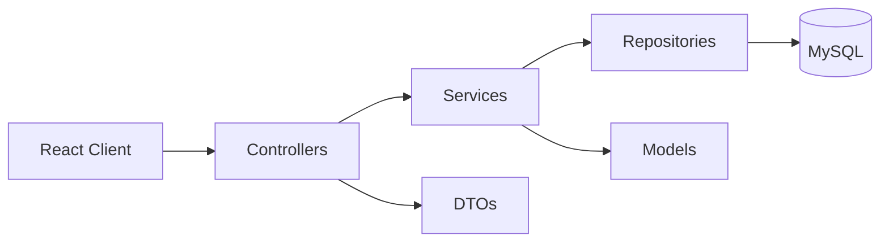
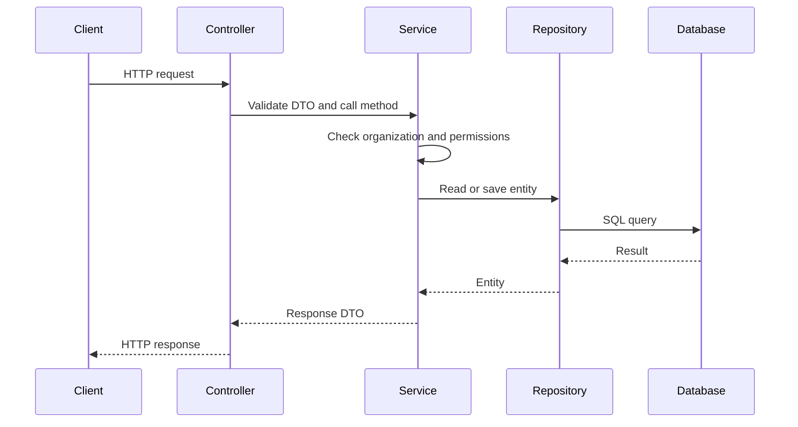

# FlowOS Server Architecture

## Overview

The FlowOS backend uses a simple layered Spring Boot architecture.



## Layers

### Controllers

Controllers receive HTTP requests and return HTTP responses. A controller should not contain business rules.

Example responsibility: receive a request to create a team and call `TeamService`.

### Services

Services contain the application rules. They check permissions, validate that records belong to the current organization, and call repositories.

Example responsibility: ensure a user belongs to an organization before adding them to a team.

### Repositories

Repositories use Spring Data JPA to read and write entities in MySQL.

Example responsibility: find all teams where `organisation_id` matches the current organization.

### Models

Models are JPA entities that map Java classes to database tables. The core models are:

- `Organisation`
- `User`
- `OrganisationMember`
- `Team`
- `TeamMember`
- `Role`
- `Permission`
- `Module`
- `InstalledModule`
- `Notification`
- `AuditLog`

### DTOs

DTOs define API input and output. Controllers should use DTOs instead of returning JPA entities directly.

### Mappers

Mappers convert entities into DTOs and DTOs into entities.

## Main Data Rules

- A `User` can join one or more organizations through `OrganisationMember`.
- Each organization membership has one role.
- A team belongs to one organization.
- A team member must reference an `OrganisationMember`.
- Roles and permissions have a many-to-many relationship through `role_permissions`.
- An organization can install a module only once.

More detail is in [CORE_ENTITY_RELATIONSHIPS.md](CORE_ENTITY_RELATIONSHIPS.md).

## Organization Data Isolation

All organization-specific data must be filtered by organization ID.

For example, a service fetching teams for organization `5` must only query teams with `organisation_id = 5`. It must never fetch a team by ID and return it without verifying that it belongs to the current organization.

This rule applies to users, memberships, teams, roles, installed modules, audit logs, and all future modules.

## Request Flow



## Development Rules

- Keep controllers small.
- Put business rules in services.
- Access the database only through repositories.
- Use DTOs for API requests and responses.
- Check the organization ID before returning or changing data.
- Add permissions before exposing a sensitive action.
- Add tests when adding business logic.

## Database Strategy

During initial development, Hibernate creates and updates the schema with:

```properties
spring.jpa.hibernate.ddl-auto=update
```

Before production, replace this with Flyway migrations. Flyway is already included in the project but currently disabled in `application.properties`.
